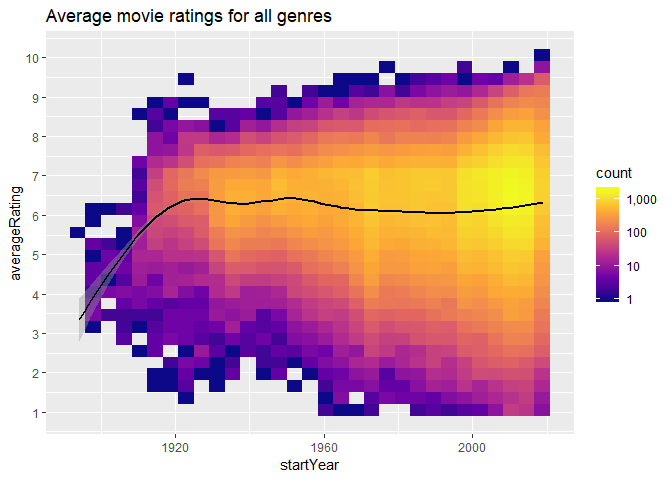
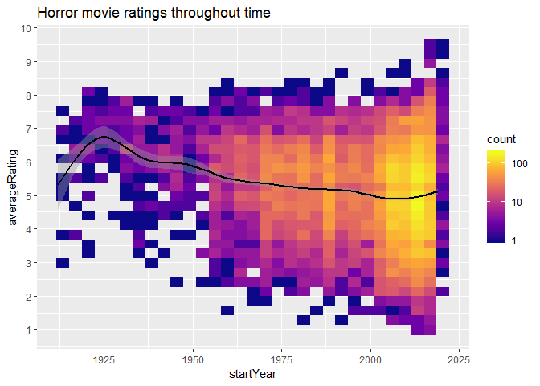
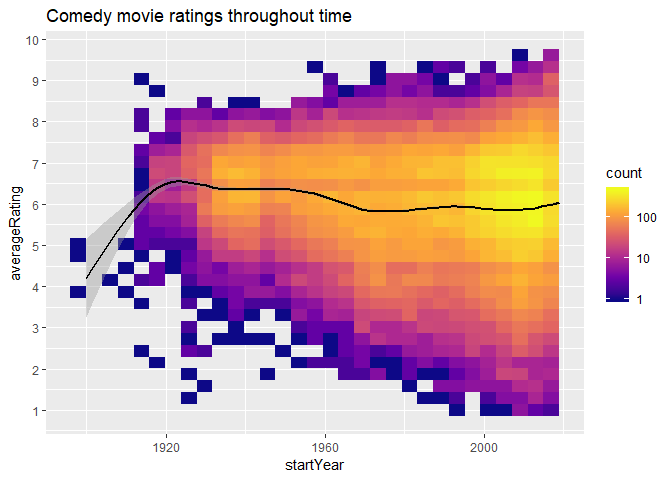

IMDB Analysis
================
Julian Villar
30 April 2019

# Are movies getting better?

## Introduction

Do you miss the good old days? Nostalgia really has a way of messing
with our perception of whether things are improving. Clearly in
technological terms we are better off, but what about culturally? To
question whether art is getting better or worse is completely
subjective, but what if we could ask everyone what they think on pieces
of art throughout time and rate it, that way we could quantify whether
there is improvement or not. Thanks to the Internet Movie Database
(IMDb) we can.

Using Data acquired on the 16th July 2018 publically available from
IMDb, we will report our findings. \#\# Tools used

``` r
library(tidyverse)
library(ggrepel) 
library(gghighlight)
library(ggridges)
library(tidytext)
library(readr)
library(scales)
library(knitr)
```

## Ratings

Perhaps before we search through trends throughout time, it is better to
establish a baseline. The average movie rating fits this purpose and
naturally falls a good entry point to this report.

We introduce our first dataset, df\_ratings. That is the ratings data
frame. This is our simplest dataset and provides us the Movie ID that’ll
act as a Foreign key between our various datasets, the average rating
for a movie (averageRating) and the number of votes for each movie
(numVotes).

We provide the first few entries to show this dataset clearly.

    ## # A tibble: 6 x 3
    ##   tconst    averageRating numVotes
    ##   <chr>             <dbl>    <dbl>
    ## 1 tt0000001           5.8     1491
    ## 2 tt0000002           6.3      181
    ## 3 tt0000003           6.6     1127
    ## 4 tt0000004           6.4      110
    ## 5 tt0000005           6.2     1829
    ## 6 tt0000006           5.5       96

We begin by plotting the average rating of all movies.

``` r
p <- ggplot(df_ratings, aes(x = numVotes, y = averageRating))
p <-      p +
          geom_bin2d() +
          scale_x_log10(labels = comma) +
          scale_y_continuous(breaks = 1:10) +
          scale_fill_viridis_c(labels = comma,option = "E") +
          labs(x="Number of Votes", y="Average Rating", title="Average IMBd rating and how many people vote that way")
plot(plot)
```

## Expanding our dataset

Now this extensive dataset is added, we’ll combine them

    ## # A tibble: 6 x 11
    ##   tconst averageRating numVotes titleType primaryTitle originalTitle
    ##   <chr>          <dbl>    <dbl> <chr>     <chr>        <chr>        
    ## 1 tt000~           5.8     1491 short     Carmencita   Carmencita   
    ## 2 tt000~           6.3      181 short     Le clown et~ Le clown et ~
    ## 3 tt000~           6.6     1127 short     Pauvre Pier~ Pauvre Pierr~
    ## 4 tt000~           6.4      110 short     Un bon bock  Un bon bock  
    ## 5 tt000~           6.2     1829 short     Blacksmith ~ Blacksmith S~
    ## 6 tt000~           5.5       96 short     Chinese Opi~ Chinese Opiu~
    ## # ... with 5 more variables: isAdult <dbl>, startYear <dbl>,
    ## #   endYear <lgl>, runtimeMinutes <dbl>, genres <chr>

Now with our new extensive data frame we move to perform the real
analysis.
<!-- -->

Making a subset was the first challenge, this is as
follos

``` r
df_ratingsHORROR = subset(df_ratings, grepl("Horror", genres))
```

``` r
plot2 <- ggplot(df_ratingsHORROR %>% filter(titleType == "movie", numVotes >= 10), aes(x = startYear, y = averageRating)) +
          geom_bin2d() +
          geom_smooth(color="black") +
          scale_x_continuous() +
          scale_y_continuous(breaks = 1:10) +
          scale_fill_viridis_c(option = "plasma", labels = comma, trans = 'log10') + 
          labs(title="Horror movie ratings throughout time")
plot(plot2)
```

<!-- --> As
previously done for Horror we will now recreate for Comedy

``` r
df_ratingsCOMEDY = subset(df_ratings, grepl("Comedy", genres))
```

might be error here pls
no

``` r
plot3 <- ggplot(df_ratingsCOMEDY %>% filter(titleType == "movie", numVotes >= 10), aes(x = startYear, y = averageRating)) +
          geom_bin2d() +
          geom_smooth(color="black") +
          scale_x_continuous() +
          scale_y_continuous(breaks = 1:10) +
          scale_fill_viridis_c(option = "plasma", labels = comma, trans = 'log10') + 
          labs(title="Comedy movie ratings throughout time")
plot(plot3)
```

<!-- -->
