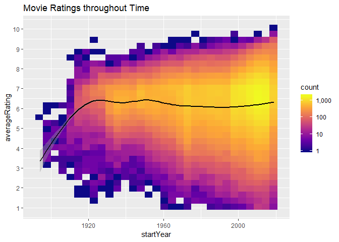

IMDB Analysis
================
Julian Villar
30 April 2019

# Are movies getting better?

## Introduction

Do you miss the good old days? Nostalgia really has a way of messing
with our perception of whether things are improving. Clearly in
technological terms we are better off, but what about culturally? To
question whether art is getting better or worse is completely
subjective, but what if we could ask everyone what they think on pieces
of art throughout time and rate it, that way we could quantify whether
there is improvement or not. Thanks to the Internet Movie Database
(IMDb) we can.

Using Data acquired that is publicly available from IMDb
[here](https://datasets.imdbws.com/), we will report our findings.

## Tools used

``` r
library(tidyverse)
library(ggrepel) 
library(gghighlight)
library(ggridges)
library(tidytext)
library(readr)
library(scales)
library(knitr)
```

## Ratings

Perhaps before we search through trends throughout time, it is better to
establish a baseline. The average movie rating fits this purpose and
naturally falls a good entry point to this report.

We introduce our first dataset, `df_ratings`. That is the ratings
dataset which we’ve imported and named `data`. This is our simplest
dataset and provides us the Movie ID that’ll act as a Foreign key
between our various datasets, the average rating for a movie
(averageRating) and the number of votes for each movie (numVotes).

We provide the first few entries to show this dataset clearly.

    ## # A tibble: 6 x 3
    ##   tconst    averageRating numVotes
    ##   <chr>             <dbl>    <dbl>
    ## 1 tt0000001           5.8     1491
    ## 2 tt0000002           6.3      181
    ## 3 tt0000003           6.6     1127
    ## 4 tt0000004           6.4      110
    ## 5 tt0000005           6.2     1829
    ## 6 tt0000006           5.5       96

We begin by understanding the spread of average ratings regardless of
how many votes each movie has.

``` r
p1 <- ggplot(df_ratings, aes(x=averageRating)) + 
      geom_histogram(binwidth = 0.4) + 
      labs(x="Count", y="Average Rating", title="Distribution of average rating for all movies")
p1
```

<!-- --> This
provides a better understanding than just calculating the mean,
strangely we see an average between 6.5-7.5. The implications of this
are complex, more than likely we can suggest that people who
particularly like certain movies are more likely to vote. However the
lack of scores between 2-5 suggest that people really don’t use those
votes.

``` r
p2 <-     ggplot(df_ratings, aes(x = numVotes, y = averageRating))
p2 <-     p2 +
          geom_bin2d() +
          scale_x_log10(labels = comma) +
          scale_y_continuous(breaks = 1:10) +
          scale_fill_viridis_c(labels = comma,option = "E") +
          labs(x="Number of Votes", y="Average Rating", title="Average IMBd rating and how many people vote that way")
plot(p2)
```

<!-- -->

## Expanding our dataset

We’ve exhausted this dataset, we’ll now extend the data we’re looking at
to include Movie Titles and their genres/years created.

``` r
df_basics = read_imdb("\\data2.tsv")
```

We’ll join these together through their unique movie identifier and
*improve* our original dataframe.

``` r
df_ratings <- df_ratings %>% left_join(df_basics)
head(df_ratings)
```

    ## # A tibble: 6 x 11
    ##   tconst averageRating numVotes titleType primaryTitle originalTitle
    ##   <chr>          <dbl>    <dbl> <chr>     <chr>        <chr>        
    ## 1 tt000~           5.8     1491 short     Carmencita   Carmencita   
    ## 2 tt000~           6.3      181 short     Le clown et~ Le clown et ~
    ## 3 tt000~           6.6     1127 short     Pauvre Pier~ Pauvre Pierr~
    ## 4 tt000~           6.4      110 short     Un bon bock  Un bon bock  
    ## 5 tt000~           6.2     1829 short     Blacksmith ~ Blacksmith S~
    ## 6 tt000~           5.5       96 short     Chinese Opi~ Chinese Opiu~
    ## # ... with 5 more variables: isAdult <dbl>, startYear <dbl>,
    ## #   endYear <lgl>, runtimeMinutes <dbl>, genres <chr>

Now with our new data frame we move to perform the real analysis on our
Movie Ratings, particularly with how the Average Rating changes
throughout
time.

``` r
df_ratings_filter = df_ratings %>% filter(titleType == "movie", numVotes >= 10) # Cleaning the Data

p3 <-     ggplot(df_ratings_filter, aes(x = startYear, y = averageRating)) 

p3 <-     p3 + geom_bin2d() +
          geom_smooth(color="black") +
          scale_x_continuous() +
          scale_y_continuous(breaks = 1:10) +
          scale_fill_viridis_c(option = "plasma", labels = comma, trans = 'log10') +
          labs(title="Movie Ratings throughout Time")
plot(p3)
```

<!-- -->

As somewhat expected here we see that the average rating for a movie has
changed quite dramatically, being just over 5 for movies in the 1930s to
almost every movie being around a 7. This probably boils down to recency
bias, unless movies really have got drastically better… which I
**definitely** won’t get into\!

Making Horror the subject of this we now need to adapt our code to only
include Horror examples. Note that we’re not looking for movies such
that their genre equals Horror, but rather contains Horror. This is
since there exists several movies that have multiple genres\! We make us
of the fascinating `grepl()` function for this

``` r
df_ratings_hor = subset(df_ratings, grepl("Horror", genres))
head(df_ratings_hor,15)
```

    ## # A tibble: 15 x 11
    ##    tconst averageRating numVotes titleType primaryTitle originalTitle
    ##    <chr>          <dbl>    <dbl> <chr>     <chr>        <chr>        
    ##  1 tt000~           6.4     1311 short     The Conjuri~ Escamotage d~
    ##  2 tt000~           6.7     2331 short     The House o~ Le manoir du~
    ##  3 tt000~           5.8      890 short     A Terrible ~ Une nuit ter~
    ##  4 tt000~           6.5      679 short     The Bewitch~ L'auberge en~
    ##  5 tt000~           6.2      129 short     The Halluci~ L'hallucinat~
    ##  6 tt000~           5.7      248 short     The Haunted~ The Haunted ~
    ##  7 tt000~           5.6       39 short     The Devil's~ Le cabinet d~
    ##  8 tt000~           6.1      493 short     The X-Ray F~ The X-Ray Fi~
    ##  9 tt000~           5.5       53 short     The Cavalie~ The Cavalier~
    ## 10 tt000~           4.9       13 short     The Cave of~ La caverne m~
    ## 11 tt000~           5.9        9 short     Photographi~ Photographin~
    ## 12 tt000~           7.5     2852 short     A Trip to t~ La lune à un~
    ## 13 tt000~           6.4       31 short     Cleopatra's~ Cléopâtre    
    ## 14 tt000~           6.3      449 short     Haggard's S~ La colonne d~
    ## 15 tt000~           6.4      726 short     The Sign of~ Le diable au~
    ## # ... with 5 more variables: isAdult <dbl>, startYear <dbl>,
    ## #   endYear <lgl>, runtimeMinutes <dbl>, genres <chr>

Now we’ll be able to see with the same conditions as before, how the
trend looks like for the Horror
genre\!

``` r
df_ratings_hor_filter = df_ratings_hor %>% filter(df_ratings_hor$titleType == "movie", df_ratings_hor$numVotes >= 150) 

p4 <-     ggplot(df_ratings_hor, aes(x = startYear, y = averageRating))

p4 <-     p4 + geom_bin2d() +
          geom_smooth(color="black") +
          scale_x_continuous() +
          scale_y_continuous(breaks = 1:10) +
          scale_fill_viridis_c(option = "plasma", labels = comma, trans = 'log10') + 
          labs(title="Horror movie ratings through time")
plot(p4)
```

<!-- -->

Lo and behold, the rating really is going down. We really could say this
doesn’t look as bad as it really is considering we know there’s a
potential recency bias in the data.
